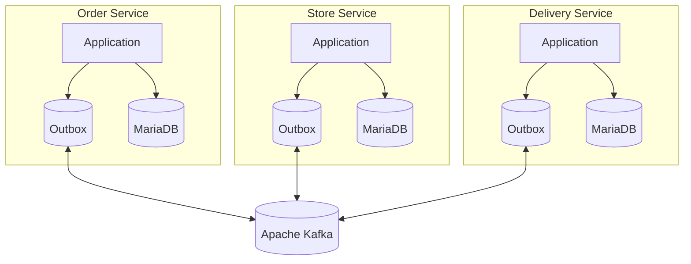
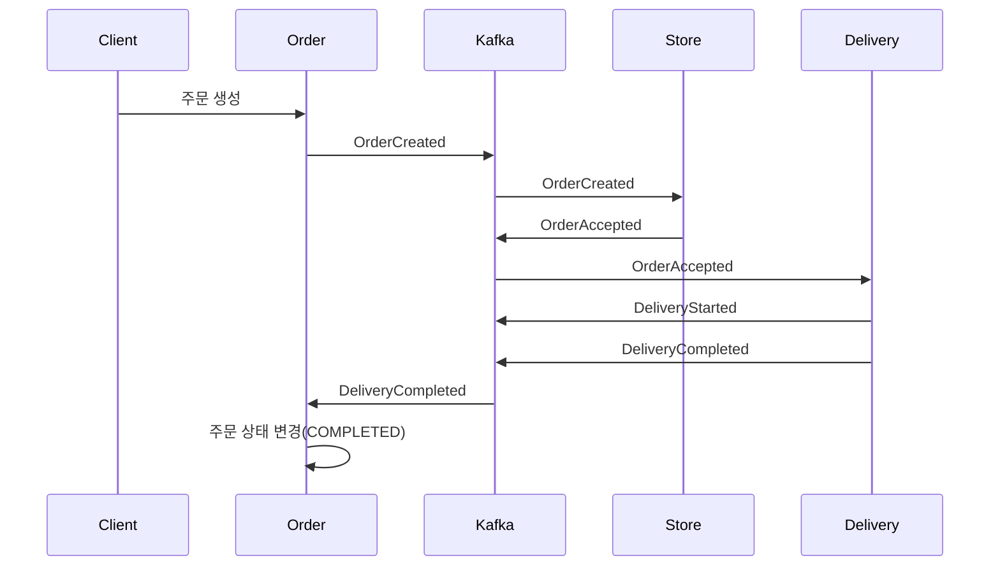

# Kafka Delivery Platform

## 프로젝트 소개

Kafka 기반의 **이벤트 드리븐(Event-Driven) 배달 서비스**입니다.

주문(Order), 매장(Store), 배달(Delivery) 서비스를 각각 독립적인 마이크로서비스(MSA)로 구성하였으며,
서비스 간 데이터 동기화는 **Apache Kafka**를 통해 수행합니다.

또한 **Outbox Pattern**을 적용하여 데이터베이스 트랜잭션과 이벤트 발행의 일관성을 보장하였으며,
Kafka Producer의 Idempotence 설정과 UUID v7을 활용하여 안정성과 성능을 함께 고려하였습니다.

## Key Features

- Event-Driven Architecture 기반 MSA 구현
- Outbox Pattern을 활용한 안정적인 이벤트 발행
- Choreography Pattern 기반 서비스 간 트랜잭션 처리
- Kafka KRaft Cluster 구성
- UUID v7를 활용한 정렬 가능한 식별자 적용
- Prometheus + Grafana를 통한 Kafka 모니터링

---

## 기술 스택

| Category | Stack |
|----------|-------|
| Language | Java 21 |
| Framework | Spring Boot 4.1 |
| Build | Gradle |
| Database | MariaDB |
| ORM | Spring Data JPA |
| Messaging | Apache Kafka (KRaft) |
| Container | Docker, Docker Compose |
| Monitoring | Prometheus, Grafana |
| Architecture | Microservices Architecture (MSA), Event-Driven Architecture |
| Design Pattern | Outbox Pattern, Choreography Pattern |

---

# 시스템 아키텍처



---

# 프로젝트 구조

```text
kafka-delivery
│
├── order-service
│   ├── API
│   ├── Order
│   ├── Outbox
│   ├── Kafka Producer
│   └── Scheduler
│
├── store-service
│   ├── Kafka Consumer
│   └── Store
│
├── delivery-service
│   ├── Kafka Consumer
│   └── Delivery
│
├── docker
│   ├── kafka
│   ├── mariadb
│   └── docker-compose.yml
│
└── README.md
```

---

# 주요 기능

### 주문 생성

- 주문 정보 저장
- Outbox 이벤트 저장
- Scheduler가 Kafka로 이벤트 발행

---

### 주문 수락

- Store Service가 주문 생성 이벤트 수신
- 주문 승인 처리
- 승인 이벤트 발행

---

### 배달 시작

- Delivery Service가 주문 승인 이벤트 수신
- 배달 생성
- 배달 시작 이벤트 발행

---

### 배달 완료

- Delivery Service가 배달 완료 이벤트 발행
- Order Service가 이벤트를 수신하여 주문 상태를 COMPLETED로 변경

---

# 이벤트 흐름

